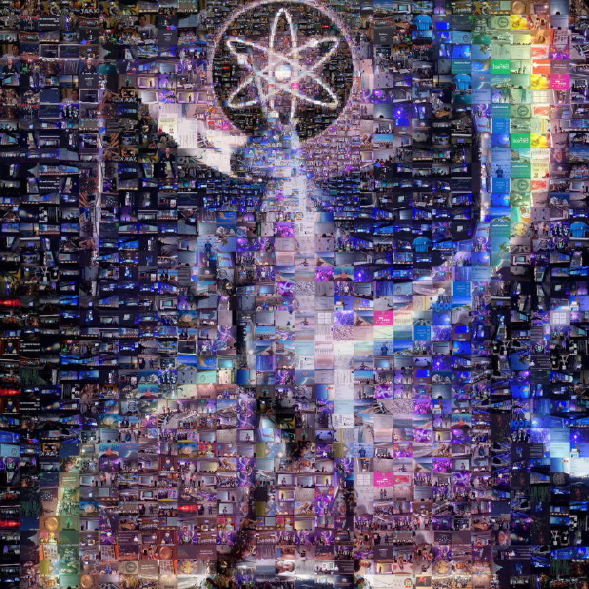
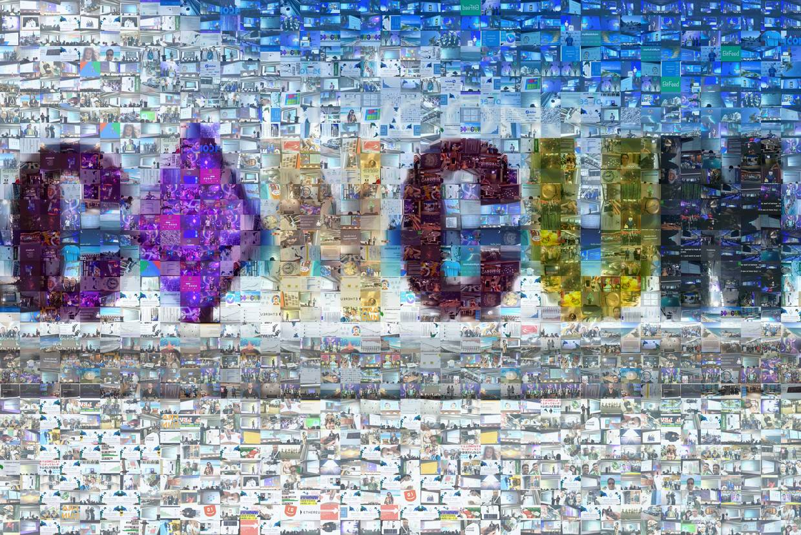

version v1.2 - newer version might be at https://github.com/drandreaskrueger/devcon3/ --> /twitterphotos/  

quickstart --> [DOWNLOAD ARCHIVE (117MB)](https://mega.nz/#!4vxE0bIL!T7vNY3rESqUJ8WQx1fgiZe06ontH5CCjszgpXf43pJk)  --> or [preview as mosaics](#preview)


# twitter: #devcon and #devcon3 photos  

Steps:  

1. Watched 40 hours livestream while it happened: https://github.com/drandreaskrueger/devcon3  
2. Stupid: I was not there. I could not take my own photos. But realized: Twitter is full of photos.  
3. Thought: Oh easy. But this time do not re-invent the wheel.  
4. Asked reddit: https://www.reddit.com/r/Python/comments/7av7l8  
5. Existing tool = I documented & extended & improved, 10 commits: https://github.com/drandreaskrueger/TwitterGeoPics  
6. Pull request: https://github.com/geduldig/TwitterGeoPics/pull/3 & left more ideas there   
7. Let it scrape for approx 20 minutes (#devcon) and 60 minutes (#devcon3) - see (*) command  
8. Removed ~50 image duplicates with *XnView MP* ... Menu Tools Search similar files ... same file data.  
9. README, compress, upload, link to it - tweet it?  
10. How to overview? --> mosaic with "AndreaMosaic" 


HERE are 1000 photos --> [DOWNLOAD ARCHIVE (117MB)](https://mega.nz/#!4vxE0bIL!T7vNY3rESqUJ8WQx1fgiZe06ontH5CCjszgpXf43pJk)

enjoy,  
AndreasKrueger  


(*) command  

```bash
python -u -m TwitterGeoPics.SearchOldTweets -words '#devcon3' -stalk  \
         -no_images_of_retweets -photo_dir ./photos/hashtag_devcon3  \
         -oauth twitterapi-oauth.txt | tee -a photos/hashtag-devcon3_tweets.txt
```

## preview
Almost all photos in two pics:

### Unicorn  
  
16x more pixels: [Mosaic01_3425x3425_20171102-175924_cosmos.jpg](Mosaic01_3425x3425_20171102-175924_cosmos.jpg) (6.6MB)   
  
16x more pixels: [Mosaic01_3425x3425_20171102-175924_cosmos.jpg](Mosaic01_3425x3425_20171102-175924_cosmos.jpg) (6.6MB)   

  
### Cancun  

16x more pixels: [Mosaic02_4960x3314_20171030-175402_rakugo.jpg](Mosaic02_4960x3314_20171030-175402_rakugo.jpg) (7.7 MB)   
  
16x more pixels: [Mosaic02_4960x3314_20171030-175402_rakugo.jpg](Mosaic02_4960x3314_20171030-175402_rakugo.jpg) (7.7 MB)   

